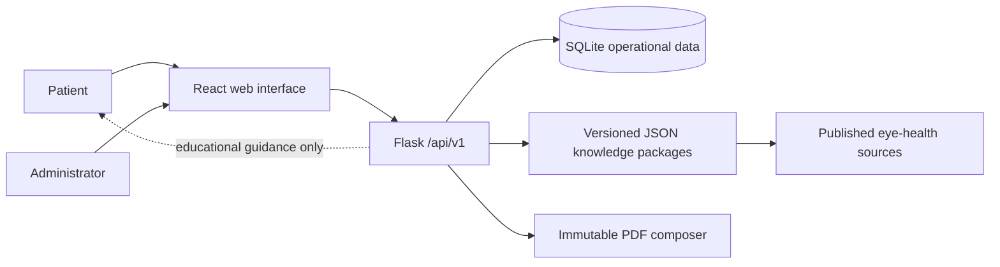
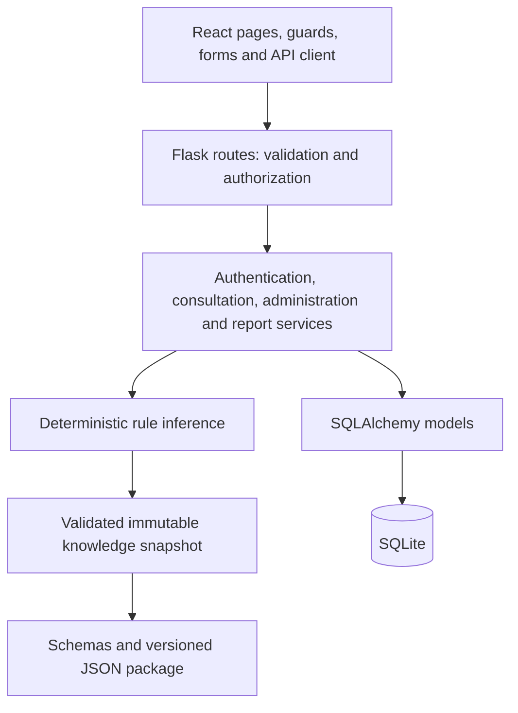
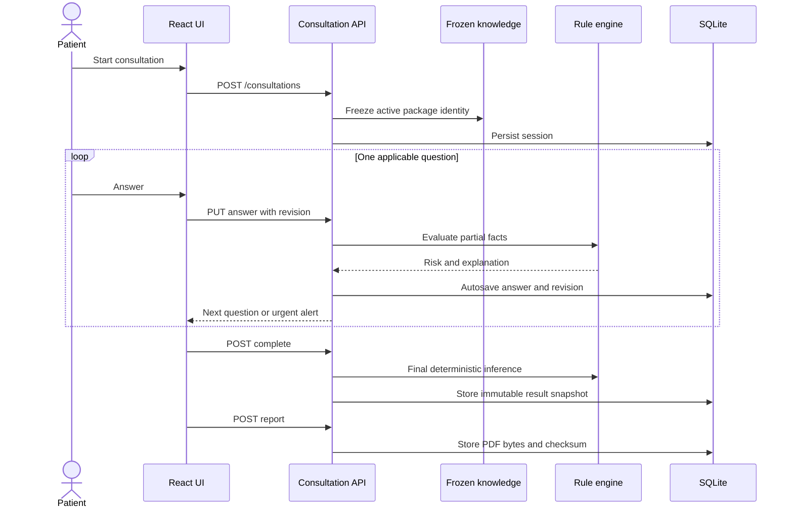
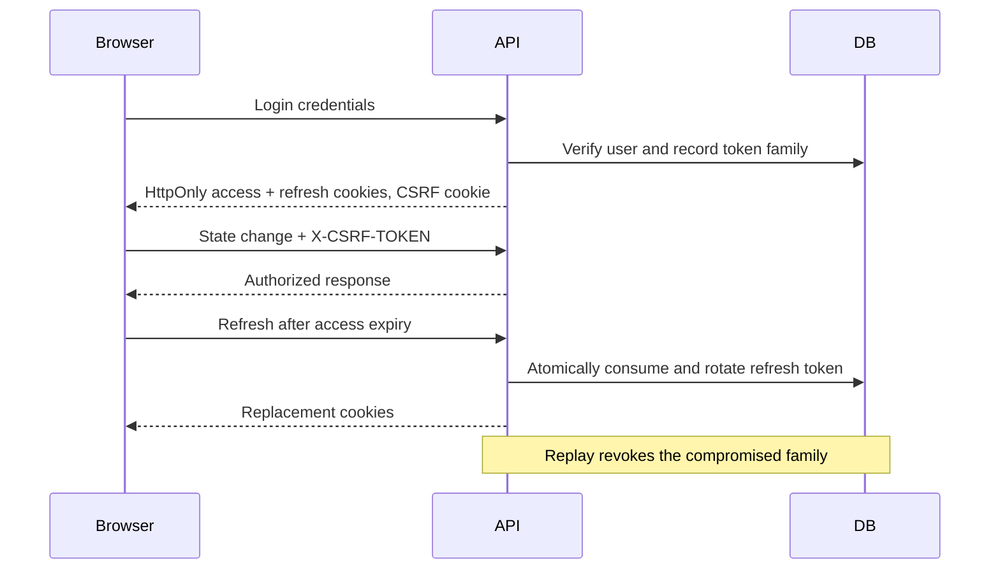
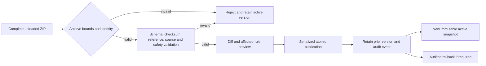
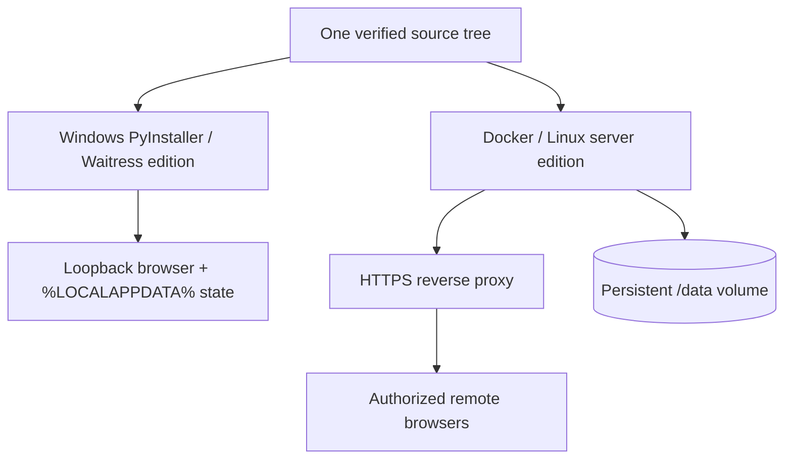

# Architecture and Defence Diagrams

These Mermaid diagrams are source-controlled projections of the implemented architecture.

## System context

## Layered components

## Consultation and report sequence

## Rotated browser session

## Governed knowledge publication

## Delivery projections

