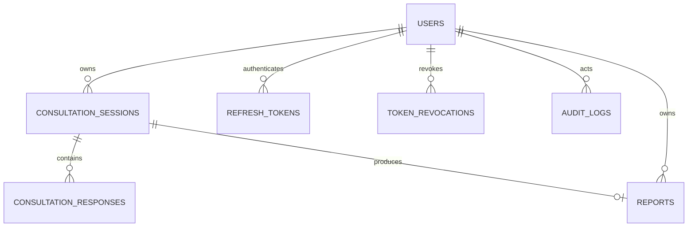

# Database and Migration Guide

## Data ownership

SQLite stores dynamic application data only. Expert-system questions, symptoms, conditions,
rules, recommendations, and risk levels remain outside the database in immutable versioned JSON
knowledge packages.

## Data dictionary

| Table | Purpose | Important constraints |
|---|---|---|
| `users` | Patient and administrator identities | UUID primary key; normalized unique email; hashed password; indexed role |
| `consultation_sessions` | Version-frozen lifecycle, revision, skips, and completed inference snapshot | User foreign key; indexed status; package fingerprint; terminal timestamps |
| `consultation_responses` | Autosaved typed answers tied to stable question and fact IDs | Consultation foreign key; unique consultation/question pair; indexed fact |
| `reports` | Immutable report snapshot and exact PDF artifact | One report per consultation; user ownership; unique PDF checksum |
| `refresh_tokens` | Hashed refresh-token identifiers and rotation families | Unique JTI hash; expiry, use, and revocation timestamps |
| `token_revocations` | Revoked access/refresh identifiers | Unique JTI hash and expiry |
| `application_events` | Operational events without secrets | Indexed level, category, and correlation identifier |
| `audit_logs` | Security and accountability trail | Optional actor, action, resource, request metadata |



SQLite foreign-key enforcement is enabled for every SQLAlchemy connection.

## Migration operations

From `backend/` with the virtual environment installed:

```powershell
.venv\Scripts\python -m flask --app run.py db upgrade
.venv\Scripts\python -m flask --app run.py db current
.venv\Scripts\python -m flask --app run.py db check
```

Create migrations only after model review:

```powershell
.venv\Scripts\python -m flask --app run.py db migrate -m "describe schema change"
```

Review generated upgrade and downgrade operations before applying them. Docker runs `db upgrade` before starting the API. Back up `instance/eye_care.db` while the application is stopped; restore only to the same schema revision, then run `db upgrade`.

## Phase 8 knowledge-version record

`knowledge_versions` retains package identity, semantic and schema versions, fingerprint,
validation report, diff preview, storage path, uploader, publication/retirement timestamps, and
active state. Package IDs and fingerprints are unique so historical knowledge cannot be
silently overwritten. Package JSON remains in the immutable package store; SQLite holds
governance metadata and audit references.

## Phase 9 report artifact

Each report row retains the JSON composition snapshot, generated filename, MIME type, SHA-256
checksum, and exact PDF bytes. This keeps repeat downloads byte-identical and includes reports
in the normal SQLite backup. Report blobs and their database cannot be backed up separately.
