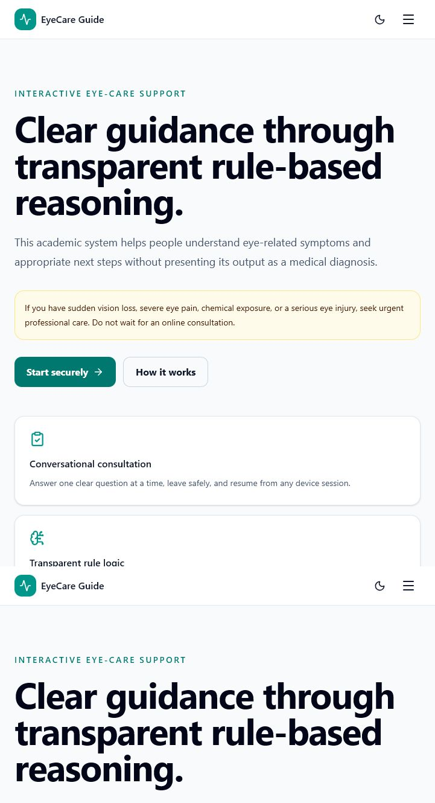

# User Guide

## Purpose and safety

The Interactive Eye Care Consultation System is an educational support tool for adults. It
uses transparent rules to identify possible indications and recommend an appropriate level of
care. It does not diagnose, prescribe, replace an eye examination, or provide emergency
services. If vision is suddenly lost, an eye is chemically exposed or seriously injured, or
severe symptoms are present, seek qualified emergency care immediately.

Use fictional information for demonstrations. A hosted operator is responsible for telling
real users how their data is handled.

## Accessing the system

The client may provide either:

- a Windows edition that opens in the default browser and stores data only for that Windows
  user; or
- a hosted HTTPS address that can be reached from a supported browser.

JavaScript and cookies must be enabled. Current Chrome, Edge, Firefox, and Safari releases are
recommended. The interface supports keyboard navigation, visible focus, responsive layouts,
and light or dark presentation.

## Create an account and sign in

1. Select **Create account**.
2. Enter a full name, email address, and a password of 12–128 characters.
3. Read the safety notice and submit the form.
4. Registration signs the patient in and opens the dashboard.

Email matching is case-insensitive. If a sign-in attempt fails, the application intentionally
uses a general error message and does not reveal whether an account exists.

## Start and complete a consultation

1. From the dashboard, select **Start consultation**.
2. Answer the single question displayed. Required questions must be answered; an optional
   question may be skipped.
3. Wait for the saved confirmation before closing the page. Progress is saved after each
   answer, so an in-progress consultation can be resumed.
4. Use the answer review controls to revise an earlier response. Branching and progress are
   recalculated safely.
5. Submit only when the completion screen confirms that all applicable required questions are
   answered.

An urgent alert may appear before completion when a red-flag answer is saved. Follow that
advice immediately; do not continue merely to obtain a report. The system prevents optional
branching from hiding mandatory safety questions.

## Understand a result

A completed result separates:

- **risk level** — the highest safety level produced by matched rules;
- **possible indications** — educational patterns, never diagnoses;
- **recommended actions** — the safest applicable next steps;
- **matched-rule explanation** — which supplied facts caused a rule to match;
- **rule-match score** — completeness of the authored rule match, not a medical probability;
- **sources** — the published material supporting the content; and
- **disclaimer** — the limits of the prototype.

When rules conflict, the highest safety risk prevails. An incomplete or no-match outcome is not
proof that an eye is healthy.

## History and PDF reports

Open **History** to resume active consultations or review completed and cancelled ones. Filters
may narrow the list by status, date, or risk. A completed consultation can generate one
immutable PDF report. Repeated downloads return the same stored report bytes and source
version.

PDFs may contain profile information and consultation answers. Save or share them only through
trusted locations. A patient can access only their own reports; administrators receive
governed review access.

## Profile, password, and sessions

The profile page can update the full name, optional phone number, and optional date of birth.
Changing the password requires the current password and revokes other sessions. **Log out**
ends the current session; **Log out all devices** revokes all active sessions for the account.

The browser never stores access or refresh tokens in local storage. Authentication uses
protected cookies and a CSRF token. Clearing site cookies signs the browser out but does not
delete the account or consultation history.

## Recover from common problems

- If a save conflicts with a newer tab, reload the consultation and review the latest answer.
- If a session expires, the application attempts one safe refresh; sign in again if it fails.
- If a PDF fails to download, keep the consultation and retry rather than starting a duplicate.
- If the Windows edition does not open, run its diagnostics command and consult the
  [troubleshooting guide](troubleshooting.md).
- Never post passwords, tokens, reports, database files, or real patient information in a
  support channel.

For administrator operations, use the [administrator guide](administration.md).
